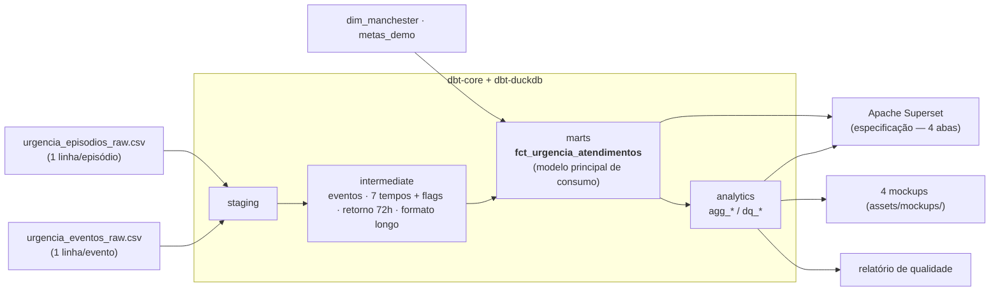
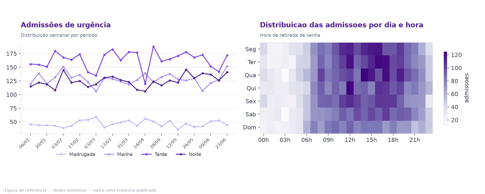
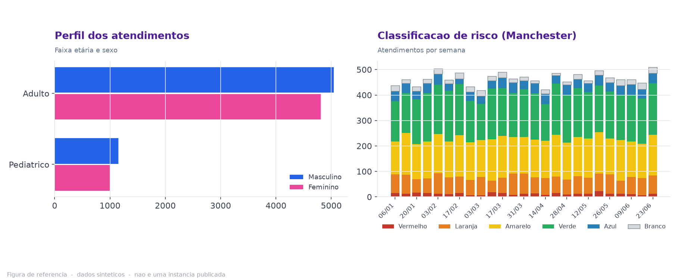
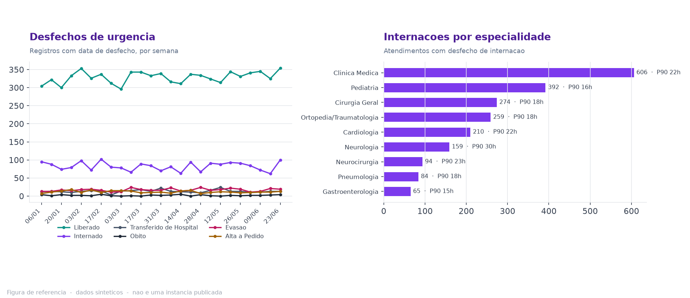
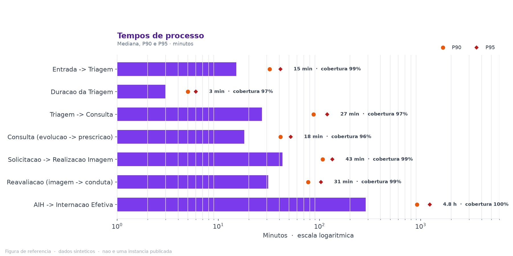

# Jornada de Urgência — Engenharia Analítica por Processo

**Do dado transacional ao dashboard, com regras de métricas versionadas.**

Estudo de caso de um projeto real de indicadores hospitalares, **em produção**
numa instituição de grande porte. Este repositório recorta a jornada de urgência
— do atendimento à internação ou desfecho — e reproduz a sua modelagem com
**dados 100% sintéticos**, **dbt-core + dbt-duckdb** e uma especificação de
consumo no **Apache Superset**. O código publicado não se conecta a nenhum
sistema institucional.

[](./PRIVACY.md)
[]()
[-informational)]()
[](./LICENSE)

> ⚠️ **Sobre os dados.** Nenhum dado de produção, de paciente ou de profissional
> foi publicado aqui. Os CSVs, os modelos de exemplo e as figuras são
> **sintéticos**, gerados por script determinístico. O extrato real que serviu
> apenas de referência de esquema **nunca foi versionado**. Detalhes em
> [`PRIVACY.md`](./PRIVACY.md).

---

## Sobre o projeto

Sou enfermeiro de formação, com 13 anos de assistência em terapia intensiva e
APH, e hoje atuo como **Data Steward** e líder do serviço de Gestão por
Informação (SGI) no Núcleo de Qualidade e Segurança de um hospital de grande
porte, referência regional.

O projeto real, **Indicadores por Processo**, transforma o dado do ERP
(**MV SOUL / Oracle**) em indicadores confiáveis para a gestão: arquitetura
institucional de dados, **dados homologados**, uma **camada semântica** de
consumo, **governança formal** com catálogo e linhagem em **OpenMetadata** e
publicação no **Apache Superset**.

O ambiente institucional possui componentes e processos próprios de produção. O
que está publicado aqui é o **recorte técnico reproduzível** da jornada de
urgência, com **dados sintéticos** e **sem integração com sistemas
institucionais**.

## O recorte deste repositório

- **Unidade de análise:** o **atendimento/episódio** de urgência, não o paciente.
- **Dashboard de 4 abas:** Entrada e Capacidade · Perfil · Desfecho · Tempos de
  Processo.
- **Pipeline único em dbt:** `seeds` → `staging` → `intermediate` → `marts`
  (`fct_urgencia_atendimentos`, o modelo principal de consumo) → `analytics`
  (`agg_*` / `dq_*`).
- **7 indicadores de tempo nomeados**, cada um com regras explícitas de
  elegibilidade, sequência temporal válida e tratamento de outliers — ver
  [`docs/metric_definitions.md`](./docs/metric_definitions.md).
- **BI:** Apache Superset, entregue como **especificação construtível + mockups**,
  não como integração automatizada — ver [`docs/dashboard.md`](./docs/dashboard.md).
- **Retorno em ≤ 72 h:** análise **exploratória**, não um KPI central.
- Os valores de referência de tempo são de **simulação** — servem para demonstrar
  o cálculo de "% acima da referência", não são metas institucionais.

> Este repositório contém apenas a jornada de urgência. Os domínios anteriores —
> Linha Cirúrgica, Paciente Crítico, análises hospital-wide e a camada SQL
> pré-dbt — permanecem recuperáveis apenas no histórico local de desenvolvimento
> e não integram a versão publicada.

## Arquitetura



Detalhe: [`docs/architecture.md`](./docs/architecture.md) ·
[`models/README.md`](./models/README.md) ·
[`docs/dashboard.md`](./docs/dashboard.md).

## Figuras de referência

Uma por aba, em [`assets/mockups/`](./assets/mockups/), geradas dos modelos dbt
por [`scripts/gerar_graficos.py`](./scripts/gerar_graficos.py) com dados
sintéticos. Não são capturas de um dashboard institucional; a especificação está
em [`docs/dashboard.md`](./docs/dashboard.md).

<table>
<tr>
<td width="50%"></td>
<td width="50%"></td>
</tr>
<tr>
<td width="50%"></td>
<td width="50%"></td>
</tr>
</table>

## Rodando localmente

**Windows (PowerShell):**

```powershell
python -m venv .venv; .\.venv\Scripts\Activate.ps1
pip install -r requirements.txt
Copy-Item profiles.yml.example profiles.yml

python scripts/gerar_urgencia_sintetico.py --episodios 12000 --seed 42
dbt seed  --profiles-dir .
dbt build --profiles-dir .
dbt docs generate --profiles-dir .
python scripts/relatorio_qualidade.py
python scripts/gerar_graficos.py
```

**Linux / macOS:**

```bash
python -m venv .venv && source .venv/bin/activate
pip install -r requirements.txt
cp profiles.yml.example profiles.yml

python scripts/gerar_urgencia_sintetico.py --episodios 12000 --seed 42
dbt seed  --profiles-dir .
dbt build --profiles-dir .
dbt docs generate --profiles-dir .
python scripts/relatorio_qualidade.py
python scripts/gerar_graficos.py
```

`profiles.yml` é uma configuração local do dbt e está no `.gitignore`.
`dbt build` executa seeds, modelos e testes configurados no projeto — ver
[`models/README.md`](./models/README.md).

## Documentação

| Documento | Conteúdo |
|---|---|
| [`docs/contexto-e-metodo.md`](./docs/contexto-e-metodo.md) | contexto profissional, o problema do case e o método de definição de indicadores |
| [`docs/architecture.md`](./docs/architecture.md) | fluxo dos dados, grão, camadas e decisões técnicas |
| [`docs/data_dictionary.md`](./docs/data_dictionary.md) | dicionário: seeds, fato e datasets analíticos |
| [`docs/metric_definitions.md`](./docs/metric_definitions.md) | os 7 indicadores de tempo: fórmula, população elegível, cobertura |
| [`docs/data_quality.md`](./docs/data_quality.md) | nulos, sequência inválida, outliers, imperfeições injetadas, testes |
| [`docs/dashboard.md`](./docs/dashboard.md) | as 4 abas, filtros, referência temporal, roteiro de montagem no Superset, guia de interpretação e limitações do dashboard |
| [`docs/parametros.md`](./docs/parametros.md) | corte etário, Manchester, valores de referência de simulação, outliers |

Fichas técnicas: [`indicadores/template_ficha_tecnica.md`](./indicadores/template_ficha_tecnica.md)
(modelo em branco) e [`indicadores/ficha_boarding.md`](./indicadores/ficha_boarding.md)
(exemplo preenchido).

## Stack

**Neste repositório**

| Camada | Ferramenta |
|---|---|
| Dados de entrada | CSV sintético determinístico (`data/synthetic/`) |
| Transformação | dbt-core + dbt-duckdb — pipeline único, testes, linhagem, `docs` |
| Consumo (BI) | Apache Superset — especificação construtível + mockups |
| Automação | Python (`pandas`, `duckdb`, `matplotlib`) |

**Contexto institucional (fora deste repositório)**

| Camada | Ferramenta |
|---|---|
| Origem | ERP hospitalar — MV SOUL / Oracle |
| Governança | OpenMetadata — catálogo, linhagem, sensibilidade |
| Consumo (BI) | Apache Superset sobre dados homologados |

*As ferramentas institucionais não estão integradas a este código.*

## Estrutura do repositório

```
.
├── README.md · PRIVACY.md · LICENSE
├── dbt_project.yml · profiles.yml.example · requirements.txt · .gitattributes
├── data/
│   ├── README.md
│   └── synthetic/
│       ├── urgencia_episodios_raw.csv        # seed — 1 linha/episódio
│       └── urgencia_eventos_raw.csv          # seed — 1 linha/evento
├── seeds/            dim_manchester.csv · metas_demo.csv · _seeds.yml
├── models/
│   ├── README.md
│   ├── staging/      stg_urgencia__episodios · stg_urgencia__eventos
│   ├── intermediate/ int_urgencia__eventos_pivot · __tempos · __retorno_72h · __tempos_long
│   ├── marts/        fct_urgencia_atendimentos            # modelo principal de consumo
│   └── analytics/    agg_urgencia__* · agg_urgencia__tempos_evento · dq_urgencia__*
├── macros/           generate_schema_name · urgencia_helpers
├── tests/            testes singulares (grão, tempos, óbito plausível, PII, ...)
├── scripts/
│   ├── gerar_urgencia_sintetico.py           # gera os 2 CSVs (determinístico)
│   ├── relatorio_qualidade.py                # relatório de qualidade reproduzível
│   └── gerar_graficos.py                     # 4 mockups (lê o dbt)
├── indicadores/
│   ├── template_ficha_tecnica.md
│   └── ficha_boarding.md
├── assets/mockups/   4 PNGs + catalog.yaml
└── docs/
    ├── contexto-e-metodo.md · architecture.md · data_dictionary.md
    ├── metric_definitions.md · data_quality.md · dashboard.md
    └── parametros.md
```

## Meu papel

Concepção da arquitetura, modelagem dos datasets, regras de negócio (aqui, em
dbt), curadoria de metadados e desenho dos indicadores com os gestores
assistenciais. O guia metodológico institucional foi desenvolvido em parceria
com a área de Qualidade.

## Contato

**Gabriel Cathcart Araújo** — Enfermeiro · Data Steward · Analista de Dados em Saúde
Núcleo de Qualidade e Segurança — Hospital Santa Casa Campo Grande
[LinkedIn](https://www.linkedin.com/in/gabriel-cathcart/) · [GitHub](https://github.com/gabrielcathcart)
