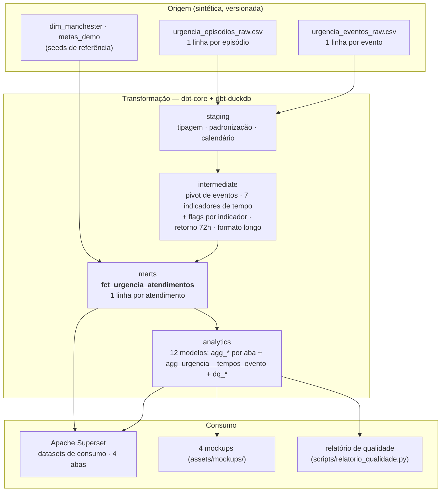

# Arquitetura

## Problema de negócio

Um pronto-socorro de grande porte gera milhares de atendimentos por mês. Sem uma
definição única, cada área calcula "tempo de triagem" ou "taxa de internação" à
sua maneira, e não há como auditar o número reportado à gestão. Este recorte
constrói essa definição para **a jornada de urgência e seus tempos de processo**
— de forma reproduzível, testada e com dados sintéticos.

## Objetivo do portfólio

Demonstrar engenharia analítica aplicada: dados sintéticos, pipeline local
reproduzível, transformação em **dbt-core + dbt-duckdb**, testes e documentação,
um fato confiável no grão de atendimento, datasets analíticos prontos para o
Superset e uma especificação de indicadores com regras de elegibilidade e
cobertura.

## Fluxo dos dados

## Grão

| Objeto | Grão |
|---|---|
| `urgencia_episodios_raw` / `stg_urgencia__episodios` / **`fct_urgencia_atendimentos`** | 1 linha por **atendimento_id** (episódio de urgência) |
| `urgencia_eventos_raw` / `stg_urgencia__eventos` | 1 linha por **evento operacional** por atendimento |
| `int_urgencia__eventos_pivot` / `int_urgencia__tempos` / `int_urgencia__retorno_72h` | 1 linha por atendimento |
| `int_urgencia__tempos_long` | 1 linha por (atendimento × indicador de tempo) |
| `analytics.agg_*` | agregados (ver `dbt docs` / `docs/dashboard.md`) |

**O mart principal tem exatamente uma linha por `atendimento_id`.** A reconciliação
com o log de eventos acontece nos modelos intermediários, já nesse grão — não há
join fato × eventos que multiplique linhas. Garantido por
`tests/assert_fct_grao_unico.sql` e `tests/assert_fct_conta_igual_stg.sql`.

## Camadas

| Camada | Materialização | Responsabilidade |
|---|---|---|
| `seeds` (`raw`, `seeds`) | table | CSVs sintéticos + dimensão de Manchester + metas demonstrativas |
| `staging` | view | tipos, timestamps, trim, normalização de categorias, campos de calendário, faixa etária re-derivada do parâmetro; **sem regra de negócio de indicador** |
| `intermediate` | view | pivot/reconciliação de eventos; os 7 indicadores de tempo e as flags por indicador (elegível/sequência inválida/outlier); retorno ≤72h; formato longo dos tempos (fonte única dos `agg` de tempo) |
| `marts` | **table** | `fct_urgencia_atendimentos` (86 colunas) — **modelo de consumo principal**; dimensões, timestamps, 7 tempos nomeados + 2 auxiliares, flags por indicador (elegível / sequência inválida / outlier / acima do valor de referência), flags de jornada e de retorno |
| `analytics` | view | 12 modelos: um conjunto por aba do dashboard + `agg_urgencia__tempos_evento` (distribuição da Aba 4) + retorno 72h (complementar) + qualidade (`dq_*`) |

Detalhe operacional: [`../models/README.md`](../models/README.md).

## Decisões técnicas

| Decisão | Alternativa | Por quê |
|---|---|---|
| dbt-core + dbt-duckdb como pipeline único | SQL puro + runner | `ref()`, linhagem, testes versionados, `docs generate`; padrão da função de Analytics Engineer |
| Dois CSVs (episódios + eventos) | um arquivo largo | separa o fato (grão de atendimento) do log auditável (grão de evento) e permite reconciliar timestamps |
| Fato no grão de atendimento; eventos resolvidos em modelos intermediários | join direto fato × eventos | evita duplicação de linhas — testado |
| `int_urgencia__tempos_long` como fonte única dos `agg` de tempo | repetir o `unpivot` em cada `agg` | uma só definição de elegibilidade/cobertura |
| Sem métricas de capacidade/ocupação | taxa de ocupação de leito | não há cadastro de leitos confiável neste escopo (ver `docs/parametros.md`) |
| Outlier configurável por indicador (IQR ou meta), nunca removido do bruto | winsorizar/remover | preserva o dado; a métrica principal usa mediana e percentis |
| Retorno ≤72h como complementar | KPI de topo | só capta retornos do próprio dataset; não é readmissão clínica validada |

## Consumo

Superset é a implementação de referência. Especificação das 4 abas, filtros,
referência temporal e roteiro de montagem: [`dashboard.md`](./dashboard.md).

## Privacidade

Nenhum dado pessoal. `paciente_id_pseudonimo` é chave sintética. Detalhes e a
decisão de não versionar o extrato real de referência: [`../PRIVACY.md`](../PRIVACY.md).
